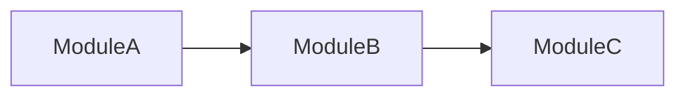

<!-- Template for refactoring reports. Referenced by REFERENCE.md > Report Template -->

## Refactoring Report: [target]

### Dependency Graph (multi-file targets only)

### Severity Summary
| Severity | Count | Status |
|----------|-------|--------|
| Critical | 0 | Resolved |
| Major | 3 | 2 Resolved, 1 Remaining |
| Minor | 5 | 3 Resolved, 2 Deferred |

### Metrics (Before → After)
| Metric | Before | After | Change |
|--------|--------|-------|--------|
| Avg Cyclomatic | 18 | 11 | -39% |
| Lines of Code | 450 | 380 | -16% |

### Methods Applied
[List each refactoring technique and why it was chosen]

### Remaining Smells
[Any deferred or new issues for follow-up]

---
Optionally save to `./reports/refactoring-report-{YYYY-MM-DD-HHMM}.md`.
